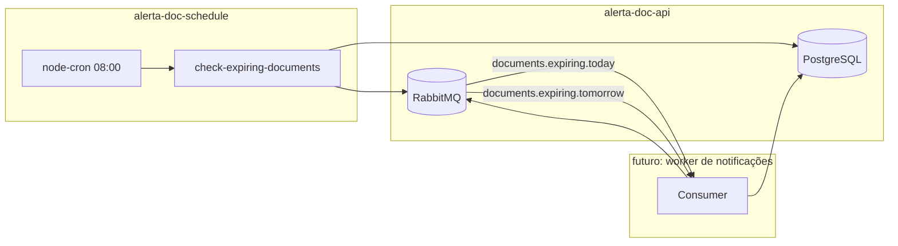

# Alerta Doc Schedule

Microserviço de **agendamento** do ecossistema [Alerta Doc](https://github.com/yuriengcomp99/alerta-doc-schedule). Ele não expõe API HTTP: apenas roda um job em horário configurado, consulta o PostgreSQL e **publica eventos** no RabbitMQ para outros serviços processarem (ex.: notificações in-app, e-mail).

## O que este serviço faz (e o que não faz)

| Faz | Não faz |
|-----|---------|
| Agenda execução via cron (padrão **08:00**, fuso `America/Sao_Paulo`) | Enviar e-mail ou notificação ao usuário final |
| Busca documentos com `expires_at` = **hoje** ou **amanhã** | Alterar documentos no banco |
| Publica **1 mensagem JSON por documento** nas filas RabbitMQ | Consumir as filas (isso é outro microserviço) |
| Log de resumo no console ao terminar | Rodar migrações de banco (feito na `alerta-doc-api`) |

## Arquitetura no ecossistema



**Dependências externas obrigatórias:**

- [alerta-doc-api](https://github.com/yuriengcomp99) (ou stack equivalente) com Postgres + RabbitMQ no ar
- Tabela `documents` com coluna `expires_at` (migration na API)
- Rede Docker compartilhada, se usar `docker compose` deste repo

## Fluxo do job


1. Calcula a data de referência em `TZ` (ex.: `2026-05-21` em São Paulo).
2. Consulta documentos cuja `expires_at` é **igual** a hoje ou a amanhã (tipo `DATE`, sem hora).
3. Para cada registro, monta um `DocumentExpiringEvent` e envia à fila correta.
4. Em caso de falha (DB/Rabbit), tenta de novo até `JOB_MAX_RETRIES` (sem loop infinito).
5. Ao concluir com sucesso, imprime quantos eventos foram publicados.

## Filas e contrato de evento

| Fila RabbitMQ | Critério no banco | `eventType` |
|---------------|-------------------|-------------|
| `documents.expiring.today` | `expires_at` = data de hoje (`TZ`) | `document.expiring.today` |
| `documents.expiring.tomorrow` | `expires_at` = data de amanhã (`TZ`) | `document.expiring.tomorrow` |

Mensagens são **persistentes**, `content-type: application/json`.

### Payload (por documento)

```json
{
  "eventId": "550e8400-e29b-41d4-a716-446655440000",
  "eventType": "document.expiring.today",
  "documentId": "uuid-do-documento",
  "title": "CNH - João Silva",
  "ownerId": "uuid-do-usuario",
  "ownerEmail": "joao@example.com",
  "expiresAt": "2026-05-21",
  "occurredAt": "2026-05-21T11:00:00.000Z"
}
```

| Campo | Uso sugerido no consumer |
|-------|---------------------------|
| `eventId` | Idempotência / auditoria |
| `eventType` | Texto ou regra (vence hoje vs amanhã) |
| `documentId` | Chave do documento |
| `ownerId` | `notifications.user_id` |
| `ownerEmail` | Envio de e-mail |
| `expiresAt` | Data no corpo da mensagem (`YYYY-MM-DD`) |
| `occurredAt` | Quando o schedule publicou o evento |

Tipo TypeScript: `src/events/document-expiring.event.ts`.

## Estrutura do projeto

```
src/
├── config/           variáveis de ambiente
├── events/           contrato DocumentExpiringEvent
├── factories/        wiring do job
├── jobs/             check-expiring-documents
├── lib/              prisma, rabbitmq, datas, retry, log admin
├── queue/            nomes das filas
├── repositories/     consulta Postgres
├── scheduler/        registro do cron
├── scripts/          execução manual do job
└── use-cases/        publicação nas filas
prisma/schema.prisma  espelho do schema (generate local)
```

## Pré-requisitos

- Node.js **20+**
- Postgres e RabbitMQ (via `alerta-doc-api` ou equivalente)
- Migration `documents.expires_at` aplicada na API:

```bash
cd alerta-doc-api
npx prisma migrate deploy
```

## Configuração

```bash
git clone https://github.com/yuriengcomp99/alerta-doc-schedule.git
cd alerta-doc-schedule
cp .env.example .env
npm install
npm run prisma:generate
```

Edite `.env` — principalmente `DATABASE_URL` e `RABBITMQ_URL` apontando para a mesma infra da API.

### Variáveis de ambiente

| Variável | Padrão | Descrição |
|----------|--------|-----------|
| `DATABASE_URL` | — | Postgres (`alerta_doc`) |
| `RABBITMQ_URL` | URL AMQP (defina no `.env`) | Broker |
| `CRON_CHECK_EXPIRING` | `0 8 * * *` | Expressão cron (node-cron) |
| `TZ` | `America/Sao_Paulo` | Fuso para “hoje/amanhã” **e** para disparo do cron |
| `JOB_MAX_RETRIES` | `3` | Tentativas do job antes de falhar |
| `RUN_ON_STARTUP` | `true` | Se `false`, só roda no horário do cron |

## Como executar

### 1. Subir infra (na API)

```bash
cd alerta-doc-api
docker compose up -d postgres rabbitmq
npx prisma migrate deploy
```

### 2. Testar o job uma vez (recomendado)

```bash
npm run job:check-expiring
```

Saída esperada (exemplo):

```text
[script] executando job check-expiring-documents (manual)
[job:check-expiring-documents] ref=2026-05-21 hoje=0 amanhã=0
[job:admin] Alerta Doc: job vencimentos OK (2026-05-21). Hoje: 0, Amanhã: 0.
```

### 3. Serviço com cron (desenvolvimento)

```bash
npm run dev
```

- Valida Postgres e RabbitMQ na subida
- Registra o cron com fuso `TZ`
- Se `RUN_ON_STARTUP=true`, executa o job imediatamente (útil em dev; em produção use `false`)

### 4. Produção

```bash
npm run build
npm start
```

### 5. Docker

Requer a rede Docker da API (`alerta-doc-api_default`):

```bash
cp .env.example .env
docker compose up -d --build
docker compose logs -f schedule
```

No compose, `DATABASE_URL` e `RABBITMQ_URL` usam hostnames `postgres` e `rabbitmq`.

## Scripts npm

| Script | Descrição |
|--------|-----------|
| `npm run dev` | Watch + cron + opcional run na subida |
| `npm run build` | Compila TypeScript → `dist/` |
| `npm start` | Roda `dist/index.js` |
| `npm run job:check-expiring` | Executa o job **uma vez** (sem cron) |
| `npm run prisma:generate` | Gera client em `src/generated/prisma-client` |

## Verificar filas no RabbitMQ

1. Abra http://localhost:15672 (credenciais do seu RabbitMQ local)
2. **Queues** → `documents.expiring.today` ou `documents.expiring.tomorrow`
3. Rode `npm run job:check-expiring` com um documento de teste:

```sql
UPDATE documents
SET expires_at = CURRENT_DATE
WHERE id = 'seu-uuid';
```

## Dados de teste

Para aparecer evento na fila **hoje**:

- `expires_at` = data de hoje no fuso `TZ`
- Documento existente na tabela `documents` (qualquer `status` hoje; o schedule não filtra status)

## Troubleshooting

| Problema | Solução |
|----------|---------|
| `expires_at` does not exist | Rode `npx prisma migrate deploy` na **alerta-doc-api** |
| Postgres / RabbitMQ indisponível | Suba `docker compose` na API; confira `.env` |
| `hoje=0 amanhã=0` | Nenhum doc com vencimento nessas datas — normal |
| Cron não às 8h em SP | Confirme `TZ=America/Sao_Paulo` no `.env` |
| Fila vazia após o job | Normal se não houver `expires_at` hoje/amanhã |

## Licença

UNLICENSED — uso conforme política do repositório / organização.
